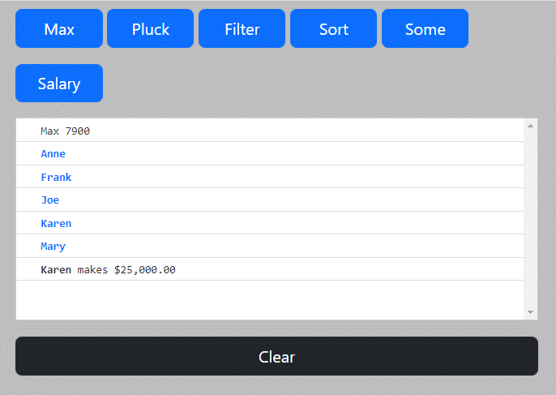

# About

Experimenting with JetBrains [WebStorm](https://www.jetbrains.com/webstorm/)  

[Underscore.js](https://underscorejs.org/#) 

Underscore.js is a utility-belt library for JavaScript that provides support for the usual functional suspects (each, map, reduce, filter...) without extending any core JavaScript objects.




```javascript
<script type="text/javascript">

    $('#btnMax').click(function (event) {
        const numbers = [100, 50, 400, 66, 7900];
        kendoConsole.log("Max " + _.max(numbers));
    });

    $('#btnPluck').click(function (event) {
        _.each(_.pluck(employeesCollection, "name"), function (element, index, list) {
            const output = index + ' ' + element;
            kendoConsole.log(output);
        })
    });

    $('#btnFilter').click(function (event) {
        _.each(_.filter([1, 2, 3, 4, 5, 6], function(num){ return num % 2 == 0; }), function (element, index) {
            const output = index + ' ' + element;
            kendoConsole.log(output);
    });
});
</script>
```


    
